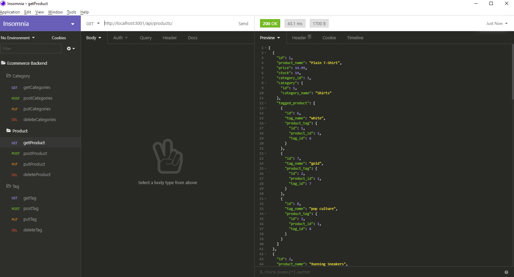

# Ecommerce Backend
## Table of Contents
  - [Project Description](#project-description)
  - [Installation](#installation)
  - [Usage](#usage)
  - [Questions](#questions)

## Project Description
This is a node app that uses a MySQL database with a Sequelize ORM. Our task was to create a backend where we can perofrm CRUD commands for products, categories of products, and tags of products.

## Walkthrough Video
[walkthrough video of app](https://drive.google.com/file/d/1xL6kOZbF4avKwjujVg15ny21GR4kWV9H/view)

## Screenshot


## Installation
1. This is a Node.js application: please make sure you have [node downloaded](https://nodejs.org/en/download/)
2. Create a local repository and [clone](https://docs.github.com/en/free-pro-team@latest/github/creating-cloning-and-archiving-repositories/cloning-a-repository) this GitHub repository to it.
3. From your mysql client, sign in to your database and run 
```
source db/schema.sql
```
4. Then configure your .env file with a password, username, and name of the database
5. Run 
```
npm i
```
6. Change false to true in the server.js file
7. run 
```
npm start
```
8. press Ctrl&C to exit after the schema loaded
9. Run 
```
npm run seed
```
10. Switch true back to false in the server.js
## Usage
1. Now you can finally run 
```
npm start
```
2. Then make certain crud actions in Insomnia Core
## Questions
* Please visit my [GitHub Profile](https://github.com/dalyd14)